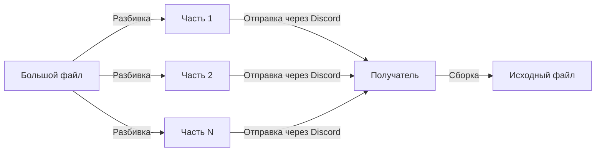

# 🔧 Discord File Splitter

**Разбивай большие файлы на части для Discord и собирай обратно — всё в браузере. Без загрузок на сервер, без установки, без лишних заморочек.**

[](https://opensource.org/licenses/MIT)
[](https://developer.mozilla.org/ru/docs/Web/HTML)
[](https://developer.mozilla.org/ru/docs/Web/JavaScript)

---

## 💡 Зачем это нужно

Discord ограничивает размер файлов: **10 МБ** для обычных пользователей и до 500 МБ для Nitro-подписчиков. Когда нужно передать большой архив, видео или сборку игры, обычно приходится:

| Вариант | Минусы |
|---------|--------|
| Файлообменники (Google Drive, Dropbox, Mega) | Нужна регистрация, ссылки протухают, файлы сканируются |
| Сильное сжатие | Потеря качества, всё равно может не влезть |
| Переименование расширений | Не решает проблему |
| Онлайн-разбиватели | **Ваши файлы загружаются на чужие серверы** |

Этот инструмент решает все эти проблемы. **Один HTML-файл. Никаких зависимостей. Полностью локально.**

---

## ✨ Возможности

- ✂️ **Разбивка** любого файла на части заданного размера (по умолчанию 9 МБ — впритык к лимиту Discord)
- 🧩 **Сборка** частей обратно в исходный файл в один клик
- 🔒 **100% локально** — ваши файлы никогда не покидают устройство
- 🌐 **Работает офлайн** — интернет не нужен после загрузки страницы
- 📱 **Адаптивность** — работает в любом современном браузере, включая мобильные
- 🎯 **Умные имена** — автоматически создаёт формат `имяфайла_part001.расширение`
- 🧹 **Без утечек памяти** — корректно очищает object URL
- ♿ **Доступность** — понятные индикаторы прогресса и обработка ошибок
- 🎨 **Чистый интерфейс** — дизайн в стиле Discord, интуитивно понятный

---

## 🛠 Как это работает



1. Отправитель открывает инструмент, выбирает файл и разбивает его на части
2. Части скачиваются локально (ничего никуда не загружается)
3. Отправитель пересылает части в Discord (личные сообщения или канал)
4. Получатель скачивает все части, открывает этот же инструмент, выбирает все части и нажимает «Собрать»
5. Исходный файл восстанавливается идеально, байт в байт

---

📥 Использование

✂️ Разбивка файла

1. Откройте discord-file-splitter.html в браузере
2. Установите желаемый размер части (по умолчанию: 9 МБ — рекомендуется для Discord)
3. Нажмите «Выберите файл» и укажите файл для разбивки
4. Нажмите «Разбить файл на части»
5. Скачайте каждую часть, нажимая на кнопки скачивания
6. Отправьте части через Discord вместе с HTML-файлом разбивателя

💡 Совет: Отправьте получателю и сам HTML-файл — он понадобится для сборки!

🧩 Сборка файла

1. Откройте discord-file-splitter.html в браузере
2. Прокрутите до секции «Собрать файл из частей»
3. Нажмите «Выберите файлы» и выберите все части
4. Нажмите «Собрать файл обратно»
5. Скачайте восстановленный исходный файл

⚠️ Важно: Убедитесь, что выбраны все части. Инструмент сортирует их автоматически по номеру в имени файла.

---

💻 Установка

Устанавливать ничего не нужно.

Просто скачайте HTML-файл и откройте его:

```bash
# Клонирование репозитория
git clone https://github.com/yourusername/discord-file-splitter.git

# Или просто скачайте HTML-файл напрямую
# Никакой сборки. Никаких зависимостей. Никакого package.json.
```

Затем откройте discord-file-splitter.html в любом современном браузере:

· ПК: Двойной клик по файлу или перетащите его в Chrome/Firefox/Edge
· Телефон: Сохраните в файлы и откройте через браузер

---

🔐 Приватность и безопасность

| Вопрос | Ответ |
|--------|-------|
| Мои файлы куда-то загружаются? | Нет. Всё работает локально в браузере через File API и Blob API. |
| Нужен ли интернет? | Нет. После загрузки страницы интернет можно отключить. |
| Есть ли отслеживание? | Нет. Никакой аналитики, куки, внешних запросов. |
| Можно ли проверить код? | Да. Это один HTML-файл. Откройте в любом текстовом редакторе. |

Инструмент использует только встроенные API браузера:

· File.slice() — для разбивки
· Blob — для сборки
· URL.createObjectURL() — для скачивания
· ArrayBuffer — для чтения частей

---

📱 Совместимость

| Браузер | ПК | Телефон |
|---------|--|--|
|Chrome |✅ |✅|
|Firefox |✅ |✅|
|Edge |✅ |✅|
|Safari |✅ |✅|
|Opera |✅ |✅|
|Brave |✅ |✅|

Минимальные требования: Любой браузер с поддержкой ES6+ и File API (то есть практически всё, что вышло после 2017 года).

---

В планах:

· Поддержка drag-and-drop для файлов
· Переключатель тёмной/светлой темы
· Прогресс-бар с процентами
· Упаковка частей в ZIP для удобной отправки
· PWA для установки как приложения
· Локализация на другие языки

---

📄 Лицензия

Проект распространяется под лицензией MIT — подробности в файле LICENSE.

Если коротко: делайте что хотите. Просто сохраните упоминание авторства.

---

Сделано с ❤️ для Discord-сообществ по всему миру.

Ни один сервер не пострадал при создании этого инструмента — потому что серверов нет;)
