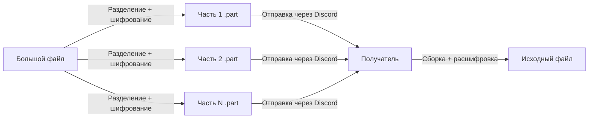
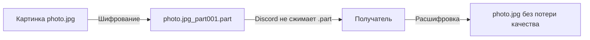

# 🔧 Discord File Splitter

**Разделяй большие файлы на части для Discord и собирай обратно — всё в браузере. Без загрузок на сервер, без установки. А ещё — обходи сжатие картинок и видео!**

---

## 💡 Зачем это нужно?

Discord ограничивает размер файлов: **10 МБ** для обычных пользователей и до 500 МБ для Nitro-подписчиков. Когда нужно отправить файл больше лимита, возникает проблема.

Кроме того, Discord **сжимает изображения и видео**, ухудшая качество. Если вы хотите передать медиафайл без потери качества, его нужно «спрятать» от алгоритмов сжатия.

| Вариант | Минусы |
|---------|--------|
| Файлообменники (Google Drive, Dropbox, Mega) | Нужна регистрация, файлы сканируются |
| Сильное сжатие | Потеря качества, всё равно может не влезть |
| Переименование расширений | Не решает проблему, Discord всё равно сжимает |
| Онлайн-сервисы | Ваши файлы загружаются на чужие серверы |

Этот инструмент решает **обе задачи**:

- **Разделение больших файлов** на части по 9 МБ для отправки в Discord
- **Антисжатие** — шифрование даже одного небольшого файла в формат `.part`, который Discord не распознаёт и не сжимает

**Один HTML-файл. Никаких зависимостей. Полностью локально.**

---

## ✨ Возможности

- ✂️ **Разделение** любого файла на части заданного размера (по умолчанию 9 МБ — впритык к лимиту Discord)
- 🔐 **Шифрование XOR** — части нельзя открыть отдельно, а медиафайлы не сжимаются
- 🧩 **Сборка** частей обратно в исходный файл в один клик
- ⬇️ **Автоскачивание** разделенных и собранных частей (требуется включения опции в настройках)
- 🎯 **Антисжатие** — работает даже с **одним файлом**: зашифруйте картинку в `.part`, отправьте, а получатель расшифрует обратно
- 🔒 **100% локально** — ваши файлы никогда не покидают устройство
- 🌐 **Работает офлайн** — интернет не нужен после загрузки страницы
- 📱 **Адаптивность** — работает в любом современном браузере, включая мобильные
- 🎯 **Умные имена** — автоматически создаёт формат `имяфайла.расширение_part001.part`
- 🧹 **Без утечек памяти** — корректно очищает object URL
- ♿ **Доступность** — понятные индикаторы прогресса и обработка ошибок
- 🎨 **Чистый интерфейс** — дизайн в стиле Discord, интуитивно понятный, а также с тёмной темой

---

## 🛠 Как это работает

### Режим 1: Разделение большого файла

1. Отправитель открывает инструмент, выбирает файл и разделяет его на части
2. Каждая часть шифруется и получает расширение `.part`
3. Части скачиваются локально (ничего никуда не загружается)
4. Отправитель пересылает части в Discord
5. Получатель скачивает все части, открывает этот же инструмент, выбирает их и нажимает «Собрать»
6. Исходный файл восстанавливается идеально, байт в байт

### Режим 2: Антисжатие (один файл)

1. Вы выбираете файл (например, `photo.jpg`, 8 МБ)
2. Устанавливаете размер части больше размера файла (например, 9 МБ)
3. Инструмент создаёт **один** файл `photo.jpg_part001.part` (зашифрованный)
4. Отправляете его через Discord — он **не сжимается**, так как формат не распознан
5. Получатель открывает инструмент, переходит в «Собрать», выбирает этот один файл
6. Получает исходную `photo.jpg` без потери качества

---

## 📥 Использование

### ✂️ Разделение файла

1. Откройте `discord-file-splitter.html` в браузере
2. Установите желаемый размер части (по умолчанию: **9 МБ** — рекомендуется для Discord)
3. Нажмите и укажите файл для разделения или просто перетащите в соответствующее поле
4. Нажмите **«Разделить файл на части»**
5. Скачайте каждую часть, нажимая на кнопки скачивания, либо нажмите **«Скачать все части»**, либо части сами скачаются
6. Отправьте части через Discord

> 💡 **Совет:** Отправьте получателю и сам HTML-файл — он понадобится для сборки!

> 💡 **Совет:** Если файл меньше 9 МБ, но вы хотите обойти сжатие Discord — просто установите размер части больше размера файла. Инструмент создаст одну зашифрованную часть.

### 🧩 Сборка файла

1. Откройте `discord-file-splitter.html` в браузере
2. Прокрутите до секции **«Собрать файл из частей»**
3. Нажмите и выберите все части (или один файл `.part` для антисжатия), либо же просто перетащите файлы
4. Нажмите **«Собрать / расшифровать»**
5. Скачайте восстановленный исходный файл, либо же он сам скачается

> ⚠️ **Важно:** Убедитесь, что выбраны **все** части. Инструмент сортирует их автоматически по номеру в имени файла. **Работает даже с одним файлом** — это режим антисжатия.

---

## 💻 Установка

**Устанавливать ничего не нужно.**

Просто скачайте ZIP-архив и распакуйте его в удобном для вас месте.

Затем откройте `discord-file-splitter.html` в любом современном браузере:

- **ПК:** Двойной клик по файлу или перетащите его в Chrome/Firefox/Edge
- **Телефон:** Сохраните в файлы и откройте через браузер

---

## 🔐 Приватность и безопасность

| Вопрос | Ответ |
|--------|-------|
| Мои файлы куда-то загружаются? | **Нет.** Всё работает локально в браузере через File API и Blob API. |
| Нужен ли интернет? | **Нет.** После загрузки страницы интернет можно отключить. |
| Есть ли отслеживание? | **Нет.** Никакой аналитики, куки, внешних запросов. |
| Можно ли проверить код? | **Да.** Это один HTML-файл. Откройте в любом текстовом редакторе. |
| Насколько надёжно шифрование? | XOR-шифрование предназначено для **обфускации** (чтобы Discord не распознал формат), а не для криптографической защиты. Для секретных данных используйте дополнительные средства. |

Инструмент использует только встроенные API браузера:

- `File.slice()` — для разделения на части
- `Blob` — для сборки
- `URL.createObjectURL()` — для скачивания
- `ArrayBuffer` — для чтения частей

---

## 📱 Совместимость

| Браузер | ПК | Телефон |
|---------|-----|---------|
| Chrome | ✅ | ✅ |
| Firefox | ✅ | ✅ |
| Edge | ✅ | ✅ |
| Safari | ✅ | ✅ |
| Opera | ✅ | ✅ |
| Brave | ✅ | ✅ |

> **Минимальные требования:** Любой браузер с поддержкой ES6+ и File API (то есть практически всё, что вышло после 2017 года).

---

## 🚀 Планы развития

- [ ] Прогресс-бар с процентами
- [ ] Локализация на другие языки

> Следите за данным репозиторием, чтобы быть в курсе новых версий и изменений!

---

## 📄 Лицензия

Проект распространяется под лицензией **MIT** — подробности в файле [LICENSE](LICENSE).

Если коротко: делайте что хотите. Просто сохраните упоминание авторства.

---

**Сделано с ❤️ для Discord-сообществ по всему миру.**

*Ни один сервер не пострадал при создании этого инструмента — потому что серверов нет ;)*
